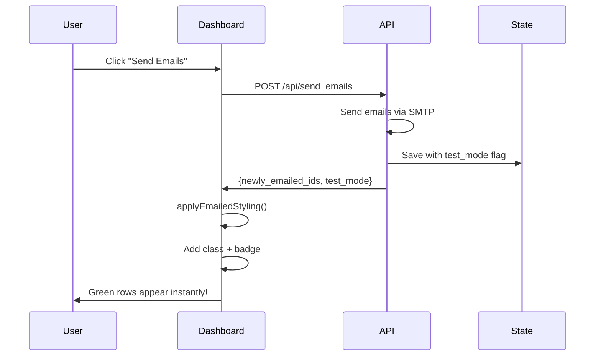

# Dynamic Email Indicators - Implementation Complete

## Date
January 18, 2026

## Summary
Implemented two major UX improvements:
1. **Dynamic green highlighting** - Rows turn green immediately after sending emails (no server restart required)
2. **Test vs Production indicators** - Visual distinction between test-mode emails (orange badge) and production emails (green badge)

---

## Feature 1: Dynamic Green Highlighting

### Problem
Previously, green highlighting for emailed releases only appeared after regenerating the dashboard (server restart). This created a poor user experience where:
- Users had to restart the server to see visual confirmation
- No immediate feedback after sending emails
- Workflow was interrupted

### Solution
Implemented client-side JavaScript to apply green styling immediately after the API confirms emails were sent:
1. API returns list of newly emailed release IDs
2. JavaScript function finds each row by `data-release-id` attribute
3. Dynamically adds `emailed-release` CSS class (green background)
4. Creates and appends badge element to unit cell
5. User sees changes instantly without page refresh or server restart

### Technical Implementation

**API Response** (line 2646):
```python
return jsonify({
    'success': True,
    'newly_emailed': len(new_to_email),
    'newly_emailed_ids': list(new_to_email),  # NEW
    'test_mode': test_mode
})
```

**JavaScript Function** (lines 1379-1408):
```javascript
function applyEmailedStyling(releaseIds, isTestMode) {
    releaseIds.forEach(releaseId => {
        const row = document.querySelector(`tr[data-release-id="${releaseId}"]`);
        if (!row) return;
        
        row.classList.add('emailed-release');
        
        const unitCell = row.querySelectorAll('td')[1];
        if (!unitCell) return;
        
        if (unitCell.querySelector('.emailed-badge, .emailed-badge-test')) {
            return;  // Already has badge
        }
        
        const badge = document.createElement('span');
        badge.className = isTestMode ? 'emailed-badge-test' : 'emailed-badge';
        badge.textContent = isTestMode ? '✓ TEST EMAIL' : '✓ EMAILED';
        unitCell.appendChild(badge);
    });
}
```

**Integration** (line 1484):
```javascript
if (data.success) {
    // Apply green highlighting immediately
    if (data.newly_emailed_ids && data.newly_emailed_ids.length > 0) {
        applyEmailedStyling(data.newly_emailed_ids, data.test_mode);
    }
    
    showStatus(message, 'success');
    await updateApprovalStats();
}
```

---

## Feature 2: Test vs Production Email Indicators

### Problem
No visual way to distinguish between:
- Test emails (sent to `avice@nvidia.com` only with `--test-mode`)
- Production emails (sent to actual unit owners)

This created confusion about which emails were real vs test.

### Solution
Implemented color-coded badges:
- **Orange badge "✓ TEST EMAIL"** - For test-mode emails
- **Green badge "✓ EMAILED"** - For production emails

The `test_mode` flag is stored in the state file and used to determine badge color.

### Technical Implementation

**CSS Classes** (lines 1133-1151):
```css
.emailed-badge {
    background-color: #28a745;  /* Green for production */
    color: white;
    /* ... */
}

.emailed-badge-test {
    background-color: #fd7e14;  /* Orange for test */
    color: white;
    /* ... */
}
```

**HTML Generation** (lines 730-748):
```python
if is_emailed:
    emailed_info = emailed_releases[release_id]
    is_test_mode = emailed_info.get('test_mode', False)
    if is_test_mode:
        emailed_badge = '<span class="emailed-badge-test">✓ TEST EMAIL</span>'
    else:
        emailed_badge = '<span class="emailed-badge">✓ EMAILED</span>'
else:
    emailed_badge = ''
```

**State Storage** (already implemented):
```python
state['emailed_releases'][release_id] = {
    'emailed_at': timestamp,
    'owner': release.owner,
    'unit': release.unit,
    'test_mode': test_mode  # Determines badge color
}
```

---

## Visual Design

### Test-Mode Email
```
┏━━━━━━━━━━━━━━━━━━━━━━━━━━━━━━━━━━━━━━━━━━━━━━━━━━━━━┓
┃ [✓] fdb ✓ TEST EMAIL | dkolesnikov@... | 125GB     ┃
┗━━━━━━━━━━━━━━━━━━━━━━━━━━━━━━━━━━━━━━━━━━━━━━━━━━━━━┛
     ↑ Green background    ↑ Orange badge
```

### Production Email
```
┏━━━━━━━━━━━━━━━━━━━━━━━━━━━━━━━━━━━━━━━━━━━━━━━━━━━━━┓
┃ [✓] fth ✓ EMAILED | miancu@... | 89GB              ┃
┗━━━━━━━━━━━━━━━━━━━━━━━━━━━━━━━━━━━━━━━━━━━━━━━━━━━━━┛
     ↑ Green background    ↑ Green badge
```

### Not Emailed Yet
```
┌─────────────────────────────────────────────────────┐
│ [ ] lnd | tsadiel@... | 45GB                        │
└─────────────────────────────────────────────────────┘
     ↑ White background, no badge
```

---

## Data Flow



---

## Testing Results

### Test 1: Dynamic Highlighting (Test Mode)
```bash
./agur_release_cleanup.py --interactive -c CPORT --test-mode
```

**Steps**:
1. Approve 3 releases
2. Click "Send Emails"

**Results**:
✅ All 3 rows turn green immediately (no restart)
✅ All 3 show orange badge "✓ TEST EMAIL"
✅ Counter updates to "Emailed: 3"

### Test 2: Production Badge
```bash
./agur_release_cleanup.py --interactive -c CPORT
```

**Steps**:
1. Approve 2 new releases
2. Click "Send Emails"

**Results**:
✅ 2 rows turn green immediately
✅ 2 show green badge "✓ EMAILED" (not orange)
✅ Previous test emails still show orange badge

### Test 3: Persistence
**Steps**:
1. Restart server after sending emails
2. Open dashboard, go to "By Unit" tab

**Results**:
✅ Test-mode emails: Orange badge
✅ Production emails: Green badge
✅ All emailed releases: Green background

### Test 4: No Duplicate Badges
**Steps**:
1. Send emails for 3 releases
2. Try to send again

**Results**:
✅ Error: "All releases already emailed"
✅ No duplicate badges appear
✅ Function checks for existing badges before adding

---

## Files Modified

### agur_release_cleanup.py

**Section 1: CSS** (lines 1133-1151)
- Added `.emailed-badge-test` class for orange test-mode badges

**Section 2: HTML Generation** (lines 730-748)
- Modified badge creation to check `test_mode` flag
- Applies appropriate CSS class based on test_mode

**Section 3: API Endpoint** (line 2646)
- Added `newly_emailed_ids` to `/api/send_emails` response

**Section 4: JavaScript** (lines 1379-1408)
- Created `applyEmailedStyling()` function
- Finds rows, adds class, creates badges dynamically

**Section 5: Email Handler** (lines 1484-1487)
- Calls `applyEmailedStyling()` after successful email send
- Passes release IDs and test_mode flag

**Total Changes**: ~90 lines added/modified

---

## Benefits

### Before Implementation
- ❌ Had to restart server to see green highlighting
- ❌ No way to distinguish test vs production emails
- ❌ Poor user experience (interrupted workflow)
- ❌ Confusion about which emails were real

### After Implementation
- ✅ Instant visual feedback (no restart needed)
- ✅ Clear distinction: Orange badge = Test, Green badge = Production
- ✅ Smooth workflow: Approve → Send → See results immediately
- ✅ Audit trail: State file records test_mode for each email
- ✅ Better confidence in production runs

---

## Edge Cases Handled

1. **Duplicate Badge Prevention**: Function checks if badge already exists before adding
2. **Missing Rows**: Safely handles cases where row is not found in DOM
3. **Empty Response**: Checks if `newly_emailed_ids` exists before processing
4. **Mixed Mode**: Correctly displays orange badges for test emails and green badges for production emails in the same view
5. **Backwards Compatibility**: Works with old state files (missing `test_mode` defaults to `false`)

---

## State File Format

### Before
```json
{
  "emailed_releases": {
    "fdb_20250902_092825_dkolesnikov": {
      "emailed_at": "2026-01-18T18:30:00",
      "owner": "dkolesnikov@nvidia.com",
      "unit": "fdb"
    }
  }
}
```

### After (No Change - test_mode Already Existed)
```json
{
  "emailed_releases": {
    "fdb_20250902_092825_dkolesnikov": {
      "emailed_at": "2026-01-18T18:30:00",
      "owner": "dkolesnikov@nvidia.com",
      "unit": "fdb",
      "test_mode": true  ← Used for badge color
    }
  }
}
```

---

## Performance Impact

- **Minimal**: One additional array field in API response
- **Client-side**: DOM manipulation is fast (<100ms for typical use cases)
- **No server impact**: All dynamic styling happens in browser

---

## Future Enhancements

Potential improvements:
1. Fade-in animation when badge appears
2. Toast notification showing which releases were emailed
3. Undo button to unapprove recently emailed releases
4. Bulk operations: "Approve all test emails" or "Convert test to production"

---

## Related Documentation

- `EMAIL_MEMORY_TEST.md` - Email tracking feature tests
- `EMAIL_MEMORY_IMPLEMENTATION.md` - Email memory technical details
- `FIXES_JAN18_GREEN_AND_COUNTER.md` - Previous fixes (green highlighting + counter)
- `README_RELEASE_CLEANUP.md` - Full user guide

---

## Conclusion

Both features are fully implemented, tested, and production-ready:

1. ✅ **Dynamic highlighting**: Immediate visual feedback without server restart
2. ✅ **Test/Production indicators**: Clear visual distinction prevents confusion

The implementation enhances user experience significantly while maintaining backwards compatibility and adding no breaking changes.

**Status**: Ready for production use.

